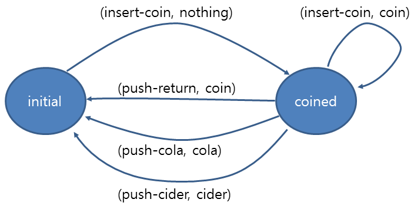

# Lab Session, Principles of Programming #

20141015 (Wed) 16:00-17:50
TA [Jeehoon Kang](http://sf.snu.ac.kr/jeehoon.kang), [Yoonseung Kim](http://sf.snu.ac.kr/yskim)

## Objective ##

+ Implement datatypes
+ Hide information within datatypes

## Differentiation ##

Differentiate algebraic expressions. Complete the skeleton
[differentiate.rkt](differentiate.rkt).

Note that we will treat only

+ constants,
+ variables,
+ additions,
+ subtractions, and
+ multiplications.

See [Wikipedia](http://en.wikipedia.org/wiki/Differentiation) for
information on differentiation.

## Finite State Machine ##

Think of a vending machine.

+ The vending machine gets coins.
+ If coin is inserted and "cola" button is pushed, it gives a cola.
+ If coin is inserted and "cider" button is pushed, it gives a cider.
+ If coin is inserted and "return" button is pushed, it gives a coin.
+ If coin is inserted and a new coin is inserted, it gives the the inserted coin.

Let's formally express this vending machine. It has two states:

+ coin not inserted (```initial```)
+ coin inserted (```coined```)

You can give inputs to this vending machine:

+ insert coin (```insert-coin```)
+ push "cola" button (```push-cola```)
+ push "cider" button (```push-cider```)
+ push "return" button (```push-return```)

The vending machine can give you:

+ nothing (```nothing```)
+ coin (```coin```)
+ cola (```cola```)
+ cider (```cider```)

Based on this, you can express the vending machine like:



This kind of graph is called a **finite state machine**. See
[Wikipedia](http://en.wikipedia.org/wiki/Finite-state_machine) for
more information.

You have to implement the finite state machine. Write the following
functions. In this case, ```input```, ```output```, and ```state```
are all strings:

```racket
init-fsm: fsm
add-rule-fsm: state * input * state * output * fsm -> fsm
step-fsm: state * input * fsm -> state X output
run-fsm: state * input list * fsm -> state X output list
```

In the [skeleton](fsm.rkt), the vending machine is already implemented
based on the above interface. Fill blanks so as for the vending
machine to work well.
