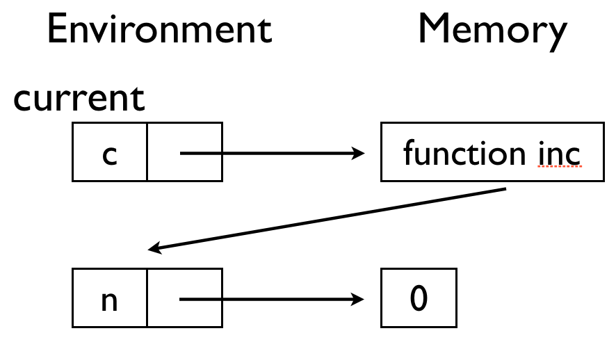

# Lab Session, Principles of Programming #

20141029 (Wed) 16:00-17:50
TA [Jeehoon Kang](http://sf.snu.ac.kr/jeehoon.kang), [Yoonseung Kim](http://sf.snu.ac.kr/yskim)

## Applicative programming vs. Imperative programming ##

You have learned *applicative* and *imperative* programming in the
last class.  In this time we practice on them.

### Summation ###

You can implement A summation function that sums 0 to `n` in the two
styles of programming.

#### Applicative programming ####

The function below is implemented as a recursive function in
applicative programming style.  Note that all variables (`n`)
appearing on the execution are **values**: their contents never
change.

```racket
(define (sum-a n)
  (if (equal? n 0)
      0
      (+ n (sum-a (- n 1)))))

(sum-a 10)
```

#### Imperative programming ####

Now in imperative style. The program below has a variable, `sum`,
whose content changes over the execution.  The content changes many
times on the execution and it finally becomes a value we want to get.

```racket
(define sum 0)

(define (sum-i n)
  (if (equal? n 0) sum
      (begin 
        (set! sum (+ n sum))
        (sum-i (- n 1)))))

(sum-i 10)
```

The function below uses the `for` statement of the racket language.
Please refer to the
[manual](http://docs.racket-lang.org/reference/for.html) for more
deatils.

```racket
(set! sum 0)

(define (sum-i-for n)
  (for ((i (+ n 1)))
       (set! sum (+ sum i)))
  sum)

(sum-i-for 10)
```

#### Finite state machine ####

Let's re-implement the finite state machine we did in the previous
weeks with the imperative programming style.

See the [skeleton code](fsm_imp.rkt).  Compare it with the
[previous week's skeleton code](../20141022/fsm.rkt).

Complete the functions `step-fsm` and `run-fsm` that execute the
finite state machine. Note that:

- `fsm` and `state` represent a finite state machine and its state,
respectively.  They are some **states**, not **values**, which means
that their contents can be changed when some functions are executed.

- The finite state machine has a type `((state X input) X (state X
output)) list`.

- The execution of `step-fsm`: (1) traversing all rules of the finite
state machine, it records the next state and output to `state` and
`output` using the input state(`input-state`) and the input
value(`input`); (2) after the traversing it ouputs `output`.

- The execution of `run-fsm`: (1) traversing all inputs in `inputs`,
it executes `step-fsm`.  At that time, the output that is return of
`step-fsm` is recorded to `output-list`; (2) after the traversing it
outputs `output-list`.

## Environment and Memory ##

Environment is a map from variables to locations. Memory is a map from locations to values. For example (from Professor's slide 3),


in the first environment, ```x``` points to a location and the
location points to tha value ```1```. Similary for ```y``` to ```2```.

In the third environment, ```y``` points to a location, and the
location points to a pair(```cons```), first(```car```) of which
points to 2 and second(```cdr```) of which points to a location of
another pair. In the picture, you can see ```x``` in the fourth
environment points to the same location.

### Counter ###

As you learned environment and memory in class and reviewed in lab
session, let's see an example: [Counter](counter.rkt).

```create-counter``` outputs a function. The function increases
internally stored ```n``` and returns it. After ```c``` is defined,
the environment and the memory look like as follows. Note that the
current environment is pin-pointed. Also note that when a
function(```c```) becomes a value, the current environment is stored
in the function value.



After ```d``` is defined, the environment and the memory look like as
follows.


Now you may understand why program runs as commented. Functions
```c``` and ```d``` assigns different locations to ```n```, so they
operate separately.
