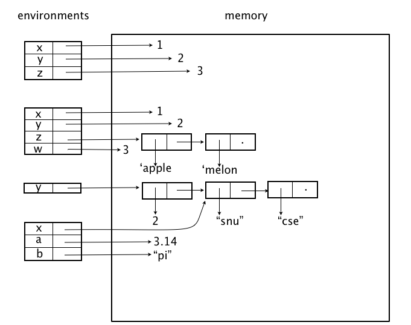
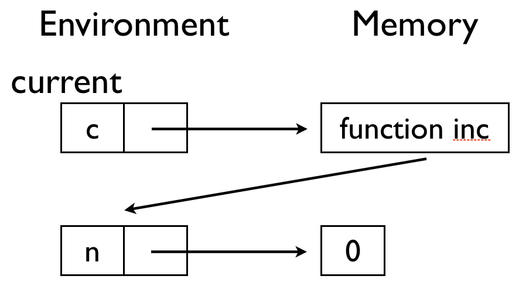

# Lab Session, Principles of Programming #

20141029 (Wed) 16:00-17:50
TA [Jeehoon Kang](http://sf.snu.ac.kr/jeehoon.kang), [Yoonseung Kim](http://sf.snu.ac.kr/yskim)

## Environment and Memory, Revisited ##

Environment is a map from variables to locations. Memory is a map from locations to values. For example (from Professor's slide 3),



in the first environment, ```x``` points to a location and the
location points to tha value ```1```. Similary for ```y``` to ```2```.

In the third environment, ```y``` points to a location, and the
location points to a pair(```cons```), first(```car```) of which
points to 2 and second(```cdr```) of which points to a location of
another pair. In the picture, you can see ```x``` in the fourth
environment points to the same location.

### Counter ###

As you learned environment and memory in class and reviewed in lab
session, let's see an example: [Counter](counter.rkt).

```create-counter``` outputs a function. The function increases
internally stored ```n``` and returns it. After ```c``` is defined,
the environment and the memory look like as follows. Note that the
current environment is pin-pointed. Also note that when a
function(```c```) becomes a value, the current environment is stored
in the function value.



After ```d``` is defined, the environment and the memory look like as
follows.


Now you may understand why program runs as commented. Functions
```c``` and ```d``` assigns different locations to ```n```, so they
operate separately.

## Mutable Lists ##

Read this
[document](http://docs.racket-lang.org/reference/mpairs.html) and
experiment with it.

## General Q&A ##
